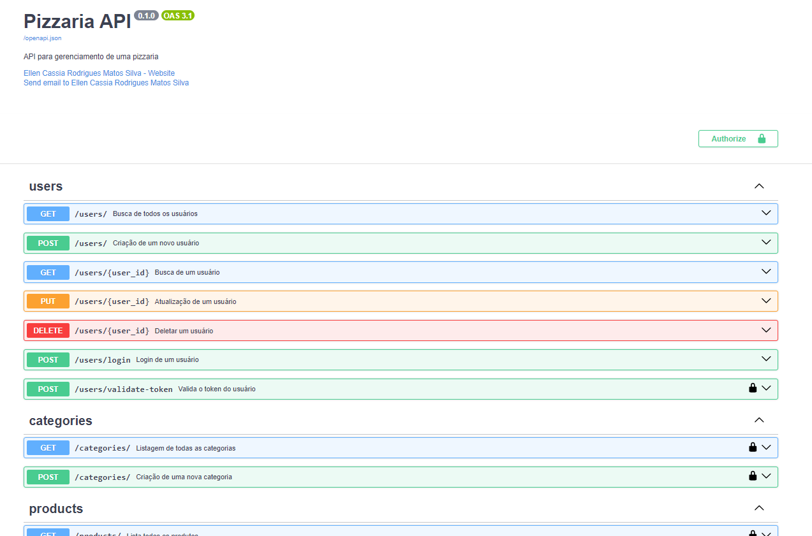

[JAVASCRIPT__BADGE]: https://img.shields.io/badge/Javascript-000?style=for-the-badge&logo=javascript
[TYPESCRIPT__BADGE]: https://img.shields.io/badge/typescript-D4FAFF?style=for-the-badge&logo=typescript
[EXPRESS__BADGE]: https://img.shields.io/badge/express-005CFE?style=for-the-badge&logo=express
[VUE__BADGE]: https://img.shields.io/badge/VueJS-fff?style=for-the-badge&logo=vue
[NEST__BADGE]: https://img.shields.io/badge/nest-7026b9?style=for-the-badge&logo=nest
[GRAPHQL__BADGE]: https://img.shields.io/badge/GraphQL-e10098?style=for-the-badge&logo=graphql
[JAVA_BADGE]:https://img.shields.io/badge/java-%23ED8B00.svg?style=for-the-badge&logo=openjdk&logoColor=white
[SPRING_BADGE]: https://img.shields.io/badge/spring-%236DB33F.svg?style=for-the-badge&logo=spring&logoColor=white
[MONGO_BADGE]:https://img.shields.io/badge/MongoDB-%234ea94b.svg?style=for-the-badge&logo=mongodb&logoColor=white
[POSTGRES_BAGDE]:https://img.shields.io/badge/postgresql-blue?style=for-the-badge&logo=postgresql&logoColor=white
[FASTAPI_BAGDE]:https://img.shields.io/badge/fastapi-black?style=for-the-badge&logo=fastapi
[sqlalchemy_bagde]:https://img.shields.io/badge/sqlalchemy-%23003B57?style=for-the-badge&logo=sqlalchemy
[docker_bagde]:https://img.shields.io/badge/docker-%232496ED?style=for-the-badge&logo=Docker&logoColor=white
[PYTHON_BAGDE]:https://img.shields.io/badge/python-%233776AB?style=for-the-badge&logo=python&color=yellow
[MAKE_BAGDE]:https://img.shields.io/badge/Make-%236D00CC?style=for-the-badge&logo=MAKE
[PYTEST_BAGDE]:https://img.shields.io/badge/pytest-%23E33332?style=for-the-badge&logo=pytest
[PYDANTIC_BAGDE]:https://img.shields.io/badge/pydantic-%23E92063?style=for-the-badge&logo=pydantic


<h1 align="center" style="font-weight: bold;">Pizzaria Sujeito </h1>

![fastapi][FASTAPI_BAGDE]
![python][PYTHON_BAGDE]
![postgres][POSTGRES_BAGDE]
![sqlalchemy][sqlalchemy_bagde]
![docker][docker_bagde]
![make][MAKE_BAGDE]
![pytest][PYTEST_BAGDE]
![pydantic][PYDANTIC_BAGDE]


<p align="center">
 <a href="#started">Getting Started</a> • 
  <a href="#routes">API Endpoints</a> •
 <a href="#colab">Collaborators</a> •
 <a href="#contribute">Contribute</a>
</p>

<p align="center">
  <b>Este projeto consiste em uma REST API desenvolvida com FastAPI para gerenciar pedidos de uma pizzaria, oferecendo funcionalidades como cadastro de produtos, pedidos e categorias. </b>
</p>

<h2 id="started">🚀 Getting started</h2>


<h3>Cloning</h3>

Clone o projeto para sua máquina local usando o comando abaixo:

```bash
git clone https://github.com/EllenCassia/pizzaria-back-end.git
```

<h3>Starting</h3>


<h4><b>Configurando o ambiente</b></h4>

1. Navegue até o diretório do projeto: 
```bash
cd pizzaria_api
``````
2. Crie um ambiente virtual e ative-o:
```bash
python -m venv venv

source venv/bin/activate 
``````
3. Instale as dependências no requirements.txt:
```bash
pip install -r requirements.txt
``````

<h4><b>Configuração do banco de dados</b></h4>

1. Rode as migrações para configurar o banco de dados:
```bash
make run-migrations
``````
2. Ou, se estiver utilizando Docker, inicie os contêineres com o banco de dados:
```bash
docker-compose up -d
``````

<h4><b>Rodando o servidor</b></h4>

Para iniciar o servidor local, execute o seguinte comando:
```bash
make run
``````


<h2 id="routes">📍 API Endpoints</h2>


| route               | description                                          
|----------------------|-----------------------------------------------------
| <kbd>GET /validate-token</kbd>     | retrieves user info see [response details](#get-auth-detail)
| <kbd>POST /login</kbd>     | authenticate user into the api see [request details](#post-auth-detail)

<h3 id="get-auth-detail">GET /validate-token</h3>

**RESPONSE**
```json
{
  {
  "email": "Example@example.com"
  }
}
```

<h3 id="post-auth-detail">POST /login</h3>

**REQUEST**
```json
{
  "username":"Example@example.com",
  "password": "4444444"
}
```

**RESPONSE**
```json
{
  {
  "access_token":"eyJhbGciOiJIUzI1NiIsInR5cCI6IkpXVCJ9k",
  "token_type": "bearer",
  "exp": "2024-10-15T19:42:51.764185"
  }
}
```


<h2 id="contribute">📫 Contribute</h2>

1. `git clone https://github.com/EllenCassia/pizzaria-back-end.git`
2. `git checkout -b feature/NAME`
3. Siga os padrões de commit
4. Abra um Pull Request explicando o problema resolvido ou feature criada, se houver, adicione um screenshot das modificações visuais e aguarde a revisão!

<h3>Documentações úteis</h3>

[📝 Como criar um Pull Request](https://www.atlassian.com/br/git/tutorials/making-a-pull-request)

[💾 Padrões de commit](https://gist.github.com/joshbuchea/6f47e86d2510bce28f8e7f42ae84c716)